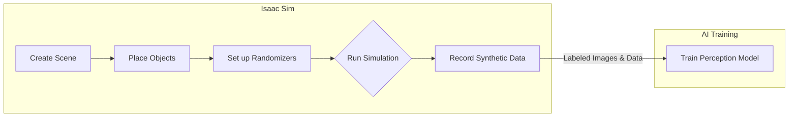

# Isaac Sim: Simulation for the AI Era

While Gazebo provides excellent physics simulation and Unity offers great rendering, **NVIDIA Isaac Sim** is built with a different purpose in mind: to be the ultimate tool for generating the data needed to train robotic AI.

Built on NVIDIA's Omniverse platform, Isaac Sim is a photorealistic, physically accurate virtual environment that leverages ray tracing and the full power of NVIDIA GPUs. Its "superpower" is its deep integration with the AI training workflow.

## Key Features of Isaac Sim

-   **RTX-Powered Photorealism:** Isaac Sim uses real-time ray tracing to produce incredibly realistic sensor data. This is crucial for bridging the "sim-to-real" gap.
-   **Physics with PhysX 5:** It uses a high-performance, GPU-accelerated physics engine, capable of simulating complex interactions with high fidelity.
-   **Domain Randomization:** To train robust AI models, you need varied data. Isaac Sim makes it easy to automatically randomize textures, lighting conditions, object poses, and camera positions. This technique, called **Domain Randomization**, creates models that can generalize better to the unpredictable real world.
-   **Built-in Data Generation:** Isaac Sim has a built-in "Synthetic Data Recorder" that can output perfectly labeled ground-truth data, such as:
    -   2D/3D Bounding Boxes
    -   Semantic Segmentation Masks
    -   Depth Images
    -   Instance Segmentation Masks

## The Synthetic Data Generation Workflow

Training a state-of-the-art object detector requires thousands of labeled images. Labeling these by hand is slow and expensive. With Isaac Sim, you can generate a massive, perfectly labeled dataset automatically.

### Example: Generating Data for a "Red Can" Detector

Imagine we want our humanoid to find a specific brand of red soda can.

1.  **Create Scene:** We build a virtual kitchen environment in Isaac Sim.
2.  **Place Objects:** We import a 3D model of the red can and place it on a table.
3.  **Set up Randomizers:** We configure domain randomization:
    -   **Pose Randomizer:** Places the can at a different random location on the table in each frame.
    -   **Light Randomizer:** Changes the direction, intensity, and color of the virtual lights.
    -   **Camera Randomizer:** Moves the robot's head camera to view the scene from different angles.
    -   **Texture Randomizer:** Applies different textures to the table and background walls.
4.  **Run Simulation & Record:** We run the simulation for 10,000 frames. For each frame, Isaac Sim saves:
    -   The rendered RGB image from the robot's camera.
    -   A JSON file containing the `[x, y, w, h]` bounding box coordinates of the red can in the image.

The output is a ready-to-use dataset. We can feed these images and labels directly into a training pipeline for a model like YOLO or Faster R-CNN. The resulting model will be highly robust to variations in lighting, object position, and viewing angle, all without a single real-world photograph being taken.

### Connecting to ROS 2

Like Gazebo and Unity, Isaac Sim is fully integrated with ROS 2. You can spawn a robot from a URDF, and Isaac Sim provides ROS 2 bridges to publish sensor data (including camera feeds and joint states) and subscribe to control commands. This means you can use the same `rclpy` nodes you developed for Gazebo to control your robot in Isaac Sim.

By using Isaac Sim as a data-generation engine, we transform simulation from just a testing tool into a core part of the AI development process itself.
