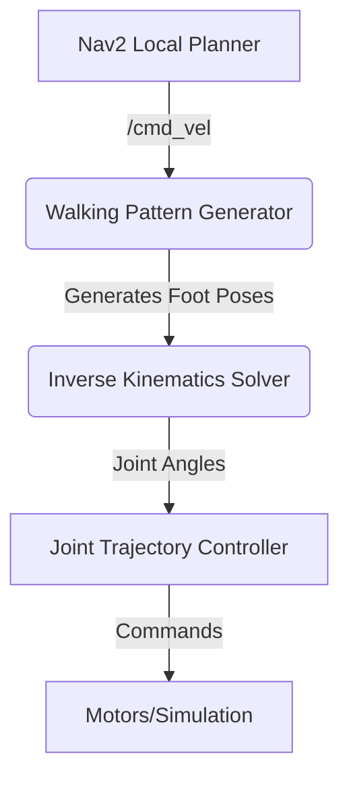

# Nav2 Path Planning for Bipedal Humanoids

While Nav2 is the standard for ROS 2 navigation, it was originally designed for wheeled robots. Applying it to a bipedal humanoid introduces a unique set of challenges that require special consideration. A wheeled robot can typically turn in place and move with continuous velocities. A humanoid cannot.

## The Challenge: From `cmd_vel` to Footsteps

The core output of Nav2's local planner is a `geometry_msgs/Twist` message on the `/cmd_vel` topic. This message specifies a desired linear velocity (forward/backward, sideways) and an angular velocity (turning).

-   For a **wheeled robot**, the base controller can directly translate these velocities into wheel speeds.
-   For a **humanoid robot**, this is not possible. A humanoid moves by taking discrete footsteps. It cannot instantaneously achieve a certain velocity or turn rate.

This creates a "translation gap" between the output of Nav2 and the input required by the humanoid's walking controller.

### The Solution: A Footstep Planner / Walking Pattern Generator

To bridge this gap, we introduce a specialized node that sits between Nav2 and the robot's low-level controllers: a **Walking Pattern Generator (WPG)**.



The WPG's job is to:
1.  **Subscribe** to the `/cmd_vel` topic from Nav2.
2.  **Interpret** the desired linear and angular velocities.
3.  **Generate a sequence of footsteps** (i.e., a series of target poses for the robot's feet) that will achieve the desired motion over time.
4.  **Maintain balance** by calculating the desired trajectory of the robot's Center of Mass (CoM).
5.  **Publish** these footstep and CoM trajectories to the next layer of the control stack (e.g., an inverse kinematics solver that calculates the required joint angles).

## Customizing Nav2 for Walking Robots

To make Nav2 work well with a walking robot, we need to tune its parameters to respect the robot's physical constraints.

### 1. Slower Acceleration and Velocities

A humanoid cannot accelerate or decelerate as quickly as a wheeled robot. We must set the acceleration and velocity limits in the Nav2 controller's configuration file to match the physical reality of the robot.

**`nav2_params.yaml` snippet:**
```yaml
controller_server:
  ros__parameters:
    # For the DWB local planner
    DWBLocalPlanner:
      max_vel_x: 0.5       # m/s, max forward speed
      min_vel_x: -0.2      # m/s, max backward speed
      max_vel_y: 0.1       # m/s, max strafe speed
      max_vel_theta: 0.4   # rad/s, max turning speed
      
      acc_lim_x: 0.25      # m/s^2
      acc_lim_y: 0.1
      acc_lim_theta: 0.3
```

### 2. The Inflation Layer and Footprint

A humanoid is not a perfect circle. It's an irregular shape, and its shape changes as it walks. We must configure Nav2's costmap to respect the robot's actual **footprint**.

The **inflation radius** in the costmap should be set large enough so that the robot doesn't try to plan paths through gaps that are too narrow for its shoulders or swinging arms.

We can define the robot's footprint as a polygon in the configuration file.

**`nav2_params.yaml` snippet:**
```yaml
local_costmap:
  ros__parameters:
    inflation_layer:
      plugin: "nav2_costmap_2d::InflationLayer"
      cost_scaling_factor: 3.0
      inflation_radius: 0.45  # A bit larger than the robot's shoulder width
    
    # You can define a polygon for the robot's footprint
    footprint: "[[0.25, 0.2], [0.25, -0.2], [-0.25, -0.2], [-0.25, 0.2]]"
```

### 3. Choosing a Local Planner

The choice of local planner is also important. Planners like **TEB (Timed Elastic Band)** or **DWB (Dynamic Window Approach)** are often preferred as they are highly configurable and can be tuned to produce smooth, achievable paths that are more suitable for a walking robot than a simple reactive planner.

By carefully tuning Nav2's parameters and creating a "translation layer" that turns velocity commands into footsteps, we can successfully adapt this powerful navigation stack for the unique dynamics of a bipedal humanoid, enabling it to walk autonomously and intelligently through its environment.
