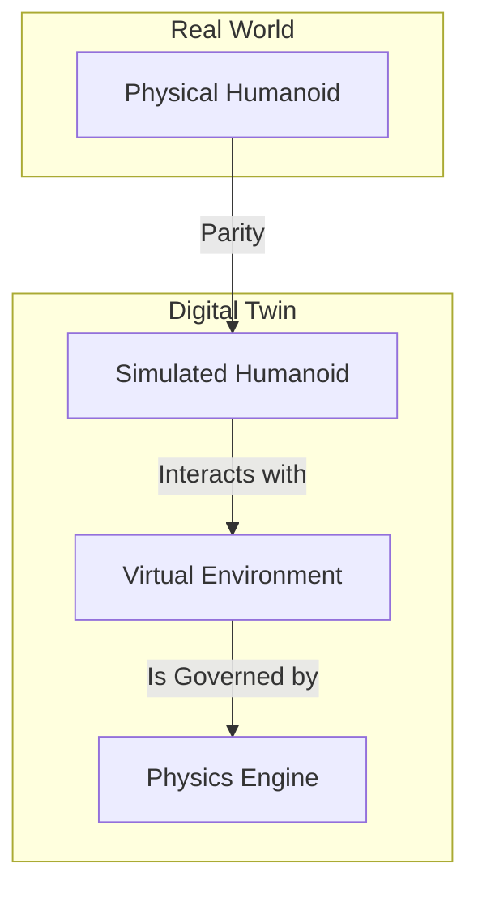

# Chapter 2: The Digital Twin

## From Blueprint to Reality

In the last chapter, we created the "nervous system" and "blueprint" of our humanoid robot using ROS 2 and URDF. But a robot does not exist in a vacuum. It needs a world to perceive, interact with, and be constrained by.

This is where simulation comes in. A **Digital Twin** is a high-fidelity virtual representation of a physical object or system. For robotics, it's an indispensable tool that allows us to:

-   **Develop and Test Safely:** Crashing a simulated robot costs nothing. Crashing a $250,000 humanoid is a disaster.
-   **Accelerate Development:** Simulation can run faster (or slower) than real-time, enabling rapid testing of algorithms.
-   **Generate Synthetic Data:** We can create perfect ground-truth data for training AI models (e.g., object detectors, segmentation models).
-   **Test in Diverse Environments:** Create endless variations of worlds and scenarios that would be impossible to replicate in the real world.

In this chapter, we will explore two of the most powerful simulation platforms in robotics: **Gazebo** and **Unity**.

### The Tools of the Trade

1.  **Gazebo (Ignition):** The successor to the classic Gazebo, now part of the Ignition Robotics suite. It is a workhorse of the ROS community, designed for robust physics simulation and tight ROS 2 integration. We'll use it to simulate the core physics, sensors, and controllers.

2.  **Unity:** A world-class real-time 3D development platform, famous in the gaming industry. Its stunning graphics, intuitive editor, and C# scripting environment make it an exceptional choice for advanced human-robot interaction (HRI) and creating photorealistic environments.

*The relationship between a physical robot and its Digital Twin.*

By the end of this chapter, you will be able to place our humanoid robot into a simulated world, complete with gravity, collisions, and virtual sensors, ready for our AI to control.
