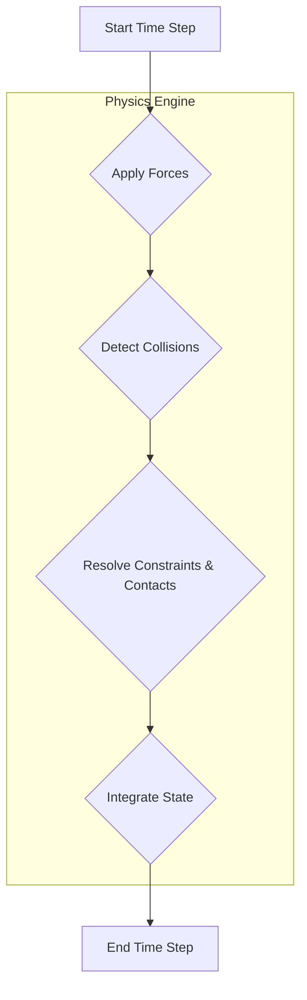

# Physics Simulation: Gravity, Collisions, and Contact

For a simulation to be useful, it must convincingly replicate the laws of physics. When our humanoid robot places a foot down, it should generate friction. When it bumps into a table, it should be stopped by it. When it drops an object, it should fall.

**Gazebo** is a "physics-first" simulator. It is built around a pluggable physics engine, with **DART (Dynamic Animation and Robotics Toolkit)** and **ODE (Open Dynamics Engine)** being the most common choices. These engines are responsible for calculating the effects of forces, torques, gravity, and collisions on every object in the scene.

## The Simulation Loop

At each time step (a tiny fraction of a second), the physics engine performs a series of calculations:



1.  **Apply Forces:** This includes gravity pulling the robot down and the torques applied by the robot's own joints.
2.  **Detect Collisions:** The engine checks if the `<collision>` geometry of any two links in the simulation are intersecting.
3.  **Resolve Constraints:** The engine calculates and applies the forces needed to resolve these collisions (contact forces) and maintain joint constraints.
4.  **Integrate State:** It updates the position and velocity of every link based on the forces and accelerations calculated.

## From URDF to SDF

While ROS uses URDF, Gazebo uses its own format called **SDF (Simulation Description Format)**. SDF is a superset of URDF, adding many simulation-specific tags.

:::info
Don't worry, you don't have to rewrite your robot model! ROS provides tools to automatically convert your URDF to SDF on the fly. However, to add Gazebo-specific properties, you'll often add special `<gazebo>` tags inside your URDF.
:::

### Enhancing URDF for Gazebo

Let's add some Gazebo-specific tags to a link in our URDF to define its physical properties more accurately.

```xml
<link name="upper_arm_link">
  <!-- ... visual, collision, inertial tags ... -->

  <!-- Gazebo-specific tags -->
  <gazebo reference="upper_arm_link">
    <material>Gazebo/Grey</material>
    <mu1>0.8</mu1> <!-- Primary coefficient of friction -->
    <mu2>0.8</mu2> <!-- Secondary coefficient of friction -->
    <kp>1000000.0</kp> <!-- Stiffness of the contact -->
    <kd>1.0</kd> <!-- Damping of the contact -->
  </gazebo>
</link>
```

In this example, we've defined:
-   **`<material>`:** The appearance of the link within Gazebo.
-   **`<mu1>` and `<mu2>`:** The friction coefficients. These are crucial for walking and grasping, as they determine how much grip the robot has.
-   **`<kp>` and `<kd>`:** Contact stiffness and damping. These affect how "bouncy" or "solid" a collision feels.

## The `ros_gz_bridge`: Connecting ROS 2 and Gazebo

How do the joint commands from our ROS 2 controller affect the simulation? And how do the simulated sensor readings get back to ROS 2? The answer is the **`ros_gz_bridge`**.

This bridge is a powerful tool that can translate messages between the ROS 2 world and the Gazebo (Ignition) world.

### Example Bridge Configuration

You would typically configure this in a launch file to bridge the joint commands and the sensor data.

```python
# In a launch file
from launch_ros.actions import Node

# Bridge to send joint commands from ROS 2 to Gazebo
joint_command_bridge = Node(
    package='ros_gz_bridge',
    executable='parameter_bridge',
    arguments=[
        '/head_controller/command@trajectory_msgs/msg/JointTrajectory@ignition.msgs.JointTrajectory'
    ],
    remappings=[
        ('/head_controller/command', '/model/simple_humanoid/joint/head_pan_joint/cmd_vel')
    ],
    output='screen'
)

# Bridge to send joint states from Gazebo to ROS 2
joint_state_bridge = Node(
    package='ros_gz_bridge',
    executable='parameter_bridge',
    arguments=[
        '/world/default/model/simple_humanoid/joint_state@sensor_msgs/msg/JointState[ignition.msgs.Model'
    ],
    remappings=[
        ('/world/default/model/simple_humanoid/joint_state', '/joint_states')
    ],
    output='screen'
)
```
This configuration sets up a two-way communication channel, allowing ROS 2 to control the simulated robot and receive feedback from it, effectively "closing the loop" in our digital twin.
