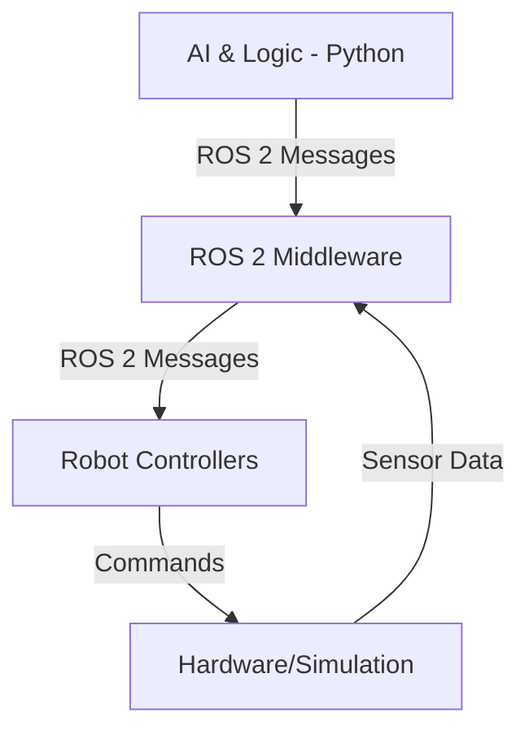

# Chapter 1: The Robotic Nervous System

## Welcome to the Core of Modern Robotics

Every advanced robot, from autonomous drones to surgical arms, needs a robust, real-time communication framework—a nervous system. In the world of robotics, the **Robot Operating System (ROS)** is that nervous system. It’s the foundational software suite that allows the robot's brain (the code) to communicate with its body (the hardware).

In this chapter, we will dive deep into **ROS 2**, the next-generation evolution of ROS. ROS 2 was redesigned from the ground up for modern robotics applications, with a focus on multi-robot systems, real-time control, and production-grade deployments.

### Why ROS 2?

-   **Performance:** Built on top of the DDS (Data Distribution Service) standard, ROS 2 offers high-performance, real-time communication suitable for complex robots.
-   **Reliability:** It features enhanced quality of service (QoS) policies, ensuring that critical messages (like an emergency stop command) are delivered reliably.
-   **Security:** ROS 2 provides a comprehensive security framework for authentication, access control, and encryption.
-   **Cross-Platform:** Supports Linux, Windows, and macOS, making development more accessible.

By the end of this chapter, you will understand the fundamental architecture of ROS 2 and be able to build a communication backbone for a humanoid robot.

*A conceptual diagram of information flow in a ROS 2 system.*
