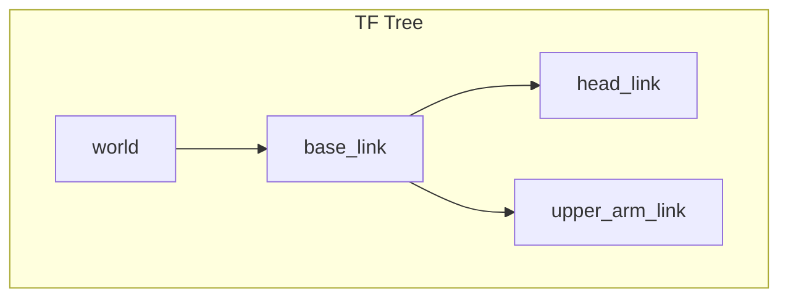

# Launch Files, Controllers, and TF Trees

We've defined our robot's structure (URDF) and know how to send messages (`rclpy`), but how do we bring the robot to life? This involves three critical components: **Launch files** to start all the necessary nodes, **Controllers** to manage the hardware, and **TF (Transform)** to keep track of where everything is.

## 1. Launch Files: Orchestrating the System

A complex robot can have dozens of nodes. Starting them one by one in separate terminals is tedious and error-prone. **Launch files** are Python scripts that allow you to start and configure a whole collection of nodes with a single command.

### Key Functions of a Launch File:

-   **Start Nodes:** Launch multiple nodes from different packages.
-   **Set Parameters:** Pass configuration parameters to nodes at startup.
-   **Remap Topics:** Change the names of topics, services, or actions.
-   **Group and Isolate:** Organize nodes into namespaces for better organization, which is crucial for multi-robot systems.

#### Example: Launching our Humanoid's Core Systems

This launch file will start:
1.  The `robot_state_publisher`, which reads the URDF and publishes the robot's structure.
2.  The `joint_state_publisher_gui`, a tool for manually controlling joints.
3.  `rviz2`, the primary visualization tool for ROS.

`simple_humanoid_launch.py`
```python
import os
from ament_index_python.packages import get_package_share_directory
from launch import LaunchDescription
from launch.actions import DeclareLaunchArgument
from launch.substitutions import LaunchConfiguration
from launch_ros.actions import Node

def generate_launch_description():
    # Get the path to the URDF file
    urdf_file_name = 'simple_humanoid.urdf'
    urdf = os.path.join(
        get_package_share_directory('your_package_name'),
        'urdf',
        urdf_file_name)
    with open(urdf, 'r') as infp:
        robot_desc = infp.read()

    return LaunchDescription([
        # Node to publish the robot's state from the URDF
        Node(
            package='robot_state_publisher',
            executable='robot_state_publisher',
            name='robot_state_publisher',
            output='screen',
            parameters=[{'robot_description': robot_desc}],
            arguments=[urdf]),
        
        # Node to provide a GUI for controlling joint states
        Node(
            package='joint_state_publisher_gui',
            executable='joint_state_publisher_gui',
            name='joint_state_publisher_gui'),
        
        # Node for RViz2 visualization
        Node(
            package='rviz2',
            executable='rviz2',
            name='rviz2',
            output='screen'),
    ])
```

## 2. Controllers: Moving the Joints

A controller is a ROS 2 node that accepts high-level commands (e.g., "move this joint to 1.57 radians") and translates them into low-level signals for the motors (or for the simulator). The `ros2_control` framework is the standard for this.

-   **Controller Manager:** A core node that loads, starts, and stops different controllers.
-   **Controller Types:**
    -   `joint_state_broadcaster`: Reads the current state (position, velocity) of the joints and publishes it to the `/joint_states` topic.
    -   `joint_trajectory_controller`: Subscribes to a trajectory topic (like the one in our `rclpy` example) and commands the joints to follow that path.

## 3. TF Trees: "Where is everything?"

In a humanoid robot, every part is moving relative to every other part. The head is moving relative to the torso, the hand is moving relative to the arm, and the torso is moving relative to the world. How do we answer the question, "Where is the robot's left hand relative to its right foot?"

The answer is **TF (Transform Frames)**. TF is a system that keeps track of the coordinate frames of all the links in the robot and how they relate to each other. It builds a **TF tree** based on the URDF's joint definitions.

-   **`tf2`:** The second generation of the TF library.
-   **`robot_state_publisher`:** This essential node reads the `/joint_states` topic (which tells it the current angle of each joint) and the URDF (which tells it the static relationship between links) to compute and broadcast the entire TF tree.

### Visualizing the TF Tree


*A simple TF tree. The arrows show the parent-child relationship.*

With a complete TF tree, you can ask `tf2` for the transformation between any two frames at any given time.

#### Example: Using TF in Code
An AI node might need to know where an object detected by the head camera is in the world frame to plan a path.

1.  **Input:** The camera detects an object at `(x, y, z)` in the `head_camera_link` frame.
2.  **TF Lookup:** The node uses `tf2` to look up the transform from `head_camera_link` to `world`.
3.  **Transformation:** It applies this transform to the object's coordinates.
4.  **Output:** The node now knows the object's position in the global `world` frame and can command the robot to walk towards it.

This process of using launch files, controllers, and TF is fundamental to operating any ROS-based robot. It's the operational backbone that allows our high-level AI to interact with a complex, multi-jointed physical system.
