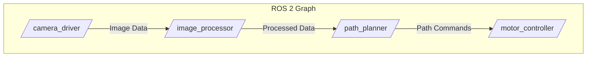

# Nodes, Topics, and Services: The Building Blocks of ROS 2

At its core, a ROS 2 system is a distributed network of processes called **Nodes**. Each node is responsible for a single, specific task, such as controlling a motor, reading a sensor, or planning a path. These nodes communicate with each other using a few key mechanisms.

## ROS 2 Graph

The entire network of nodes and their connections is called the **ROS 2 Graph**. Visualizing this graph is key to understanding and debugging a robotic system.



### 1. Topics (Asynchronous, One-to-Many Communication)

**Topics** are the most common communication method. They are named buses over which nodes broadcast messages. A node can **publish** messages to a topic, and any number of other nodes can **subscribe** to that topic to receive the messages.

-   **Analogy:** A radio station. The DJ (publisher) broadcasts music, and anyone with a radio tuned to the right frequency (subscriber) can listen.

-   **Use Case:** Streaming continuous data, like sensor readings (camera images, LiDAR scans) or the robot's current state (position, velocity).

#### Example: A Simple Publisher/Subscriber

Let's create a node that publishes the robot's battery level and another that subscribes to it.

**Publisher (Python `rclpy`)**
```python
# battery_publisher_node.py
import rclpy
from rclpy.node import Node
from std_msgs.msg import Float32
import random

class BatteryPublisher(Node):
    def __init__(self):
        super().__init__('battery_publisher')
        self.publisher_ = self.create_publisher(Float32, 'battery_level', 10)
        self.timer = self.create_timer(1.0, self.timer_callback)
        self.get_logger().info('Battery publisher has started.')

    def timer_callback(self):
        msg = Float32()
        msg.data = 95.0 + (random.random() - 0.5) # Simulate small fluctuation
        self.publisher_.publish(msg)
        self.get_logger().info(f'Publishing: "Battery: {msg.data:.2f}%"')

def main(args=None):
    rclpy.init(args=args)
    battery_publisher = BatteryPublisher()
    rclpy.spin(battery_publisher)
    battery_publisher.destroy_node()
    rclpy.shutdown()

if __name__ == '__main__':
    main()
```

**Subscriber (Python `rclpy`)**
```python
# battery_monitor_node.py
import rclpy
from rclpy.node import Node
from std_msgs.msg import Float32

class BatteryMonitor(Node):
    def __init__(self):
        super().__init__('battery_monitor')
        self.subscription = self.create_subscription(
            Float32,
            'battery_level',
            self.listener_callback,
            10)
        self.get_logger().info('Battery monitor has started.')

    def listener_callback(self, msg):
        self.get_logger().info(f'I heard: "Battery at {msg.data:.2f}%"')
        if msg.data < 20.0:
            self.get_logger().warn('Low battery warning!')

def main(args=None):
    rclpy.init(args=args)
    battery_monitor = BatteryMonitor()
    rclpy.spin(battery_monitor)
    battery_monitor.destroy_node()
    rclpy.shutdown()

if __name__ == '__main__':
    main()
```

### 2. Services (Synchronous, One-to-One Communication)

**Services** are used for request/response communication. A node offers a **service**, and another node can act as a **client** to call that service. The client sends a request and waits until it receives a response from the service provider.

-   **Analogy:** A function call, but across a network.

-   **Use Case:** Triggering a specific action that has a clear beginning and end, like "take a picture," "calculate inverse kinematics for this pose," or "save the current map."

#### Example: A Simple Service/Client

Let's create a service that adds two numbers.

**Service Definition (`.srv` file)**
First, we define the service structure.
`AddTwoInts.srv`
```
int64 a
int64 b
---
int64 sum
```

**Service Provider (Python `rclpy`)**
```python
# add_two_ints_service.py
from example_interfaces.srv import AddTwoInts
import rclpy
from rclpy.node import Node

class AddIntsService(Node):
    def __init__(self):
        super().__init__('add_two_ints_service')
        self.srv = self.create_service(AddTwoInts, 'add_two_ints', self.add_two_ints_callback)
        self.get_logger().info('Add Two Ints service is ready.')

    def add_two_ints_callback(self, request, response):
        response.sum = request.a + request.b
        self.get_logger().info(f'Incoming request: a={request.a}, b={request.b}. Returning sum={response.sum}')
        return response

def main(args=None):
    rclpy.init(args=args)
    service_node = AddIntsService()
    rclpy.spin(service_node)
    rclpy.shutdown()

if __name__ == '__main__':
    main()
```

**Client (Python `rclpy`)**
```python
# add_two_ints_client.py
from example_interfaces.srv import AddTwoInts
import rclpy
from rclpy.node import Node

class AddIntsClient(Node):
    def __init__(self):
        super().__init__('add_two_ints_client')
        self.client = self.create_client(AddTwoInts, 'add_two_ints')
        while not self.client.wait_for_service(timeout_sec=1.0):
            self.get_logger().info('Service not available, waiting again...')
        self.req = AddTwoInts.Request()

    def send_request(self, a, b):
        self.req.a = a
        self.req.b = b
        self.future = self.client.call_async(self.req)
        return self.future

def main(args=None):
    rclpy.init(args=args)
    client_node = AddIntsClient()
    future = client_node.send_request(5, 10)
    
    rclpy.spin_until_future_complete(client_node, future)
    
    try:
        response = future.result()
        client_node.get_logger().info(f'Result of add_two_ints: {response.sum}')
    except Exception as e:
        client_node.get_logger().error(f'Service call failed: {e}')
    
    client_node.destroy_node()
    rclpy.shutdown()

if __name__ == '__main__':
    main()
```

### Summary Table

| Feature      | Topics                               | Services                             |
|--------------|--------------------------------------|--------------------------------------|
| **Pattern**  | Publish / Subscribe                  | Client / Service (Request/Response)  |
| **Sync**     | Asynchronous (fire and forget)       | Synchronous (blocking call)          |
| **Relation** | Many-to-Many                         | One-to-One                           |
| **Use Case** | Continuous data streams (sensors)    | Triggering discrete actions          |
